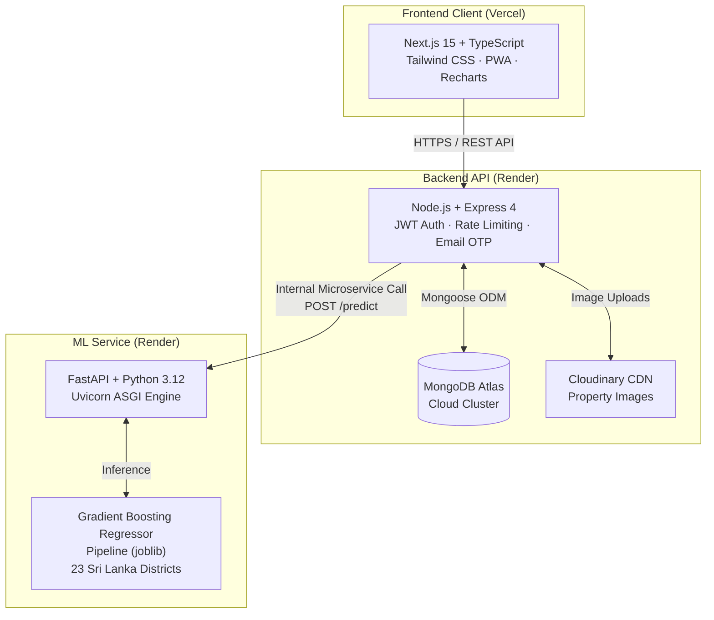

# RealEstateIQ — AI-Powered Real Estate Intelligence Platform 🇱🇰🏡

<div align="center">

[](https://real-estate-iq-pi.vercel.app)
[](https://realestateiq-1.onrender.com/health)
[](https://realestateiq-8b3k.onrender.com/health)
[](https://www.mongodb.com/atlas)
[](https://scikit-learn.org)

**A portfolio-grade Full-Stack + Machine Learning platform delivering fair-market property valuations and investment intelligence across 23 administrative districts in Sri Lanka.**

[🌐 Explore Live Website](https://real-estate-iq-pi.vercel.app) · [📖 API Documentation](https://realestateiq-8b3k.onrender.com/docs) · [🚀 Deployment Guide](RealEstateIQ/DEPLOYMENT.md)

</div>

---

## 🌟 Live Cloud Deployment

| Component | Platform | Status | Live URL |
|---|---|:---:|---|
| **Frontend Web App** | Vercel Global CDN | 🟢 Live | [real-estate-iq-pi.vercel.app](https://real-estate-iq-pi.vercel.app) |
| **Backend REST API** | Render (Singapore) | 🟢 Live | [realestateiq-1.onrender.com](https://realestateiq-1.onrender.com) |
| **ML Engine API** | Render (Singapore) | 🟢 Live | [realestateiq-8b3k.onrender.com](https://realestateiq-8b3k.onrender.com) |
| **Database** | MongoDB Atlas Cloud | 🟢 Live | AWS / Singapore Cluster |
| **Email Service** | Gmail SMTP (Nodemailer) | 🟢 Live | 6-digit Secure OTP |

---

## 🏛️ System Architecture



> **Microservice Isolation**: The frontend **never** communicates directly with the ML model. All predictions are authenticated, validated, and logged through the Node.js API gateway.

---

## 📊 Authentic Sri Lanka Market Dataset (Kaggle)

Unlike toy datasets or mock approximations, RealEstateIQ is trained on **14,800+ authentic real estate listings** sourced from verified Kaggle market data covering **23 administrative districts**:

| Province | Supported Districts | Real Records |
|---|---|:---:|
| **Western** | Colombo, Gampaha, Kalutara | **13,800+** |
| **Central** | Kandy, Matale, Nuwara Eliya | **261** |
| **Southern** | Galle, Matara, Hambantota | **305** |
| **Northern** | Jaffna, Kilinochchi, Mannar, Vavuniya, Mullaitivu | **50+** |
| **Eastern** | Batticaloa, Trincomalee, Ampara | **65+** |
| **North Western** | Kurunegala, Puttalam | **180+** |
| **North Central** | Anuradhapura, Polonnaruwa | **80+** |
| **Uva & Sabaragamuwa**| Badulla, Monaragala, Ratnapura, Kegalle | **120+** |

### 📈 50-Year Housing & Economic Timeline (1976 – 2026)
Incorporates five decades of Sri Lankan monetary expansion, infrastructure phases (Southern Expressway, Port City Colombo), and post-2022 currency realignment into valuation baselines.

---

## 🧠 Machine Learning Model Benchmarks

Multiple regression algorithms were evaluated with 5-fold cross-validation and rigorous train-test splitting (80/20):

| Model Version | Algorithm | Districts | R² Score | MAE (LKR) | Status |
|---|---|:---:|:---:|:---:|:---:|
| v1.0 | Multiple Linear Regression | 4 Hubs | 0.3120 | Rs. 14.20M | Baseline |
| v2.0 | Ridge Regression | 4 Hubs | 0.3185 | Rs. 13.85M | Benchmark |
| v3.0 | Gradient Boosting | 4 Hubs | 0.3601 | Rs. 12.09M | Intermediate |
| **v4.0 (Production)** | **Gradient Boosting Regressor** | **All 23 Districts** | **0.4134** | **Rs. 11.99M** | **🏆 Live in Prod** |

### 🔍 Key ML Features:
* **OneHotEncoder** with `handle_unknown='ignore'` for seamless handling of all 23 districts.
* **Non-linear Feature Interactions**: Area (sqft), Bedrooms, Bathrooms, House Age, Parking Spaces, and District multipliers.
* **Automatic Confidence Bounds**: Computes lower bound, upper bound, price per sq.ft, and confidence grade (`High`, `Medium`, `Standard`).

---

## ✨ Core Platform Features

- 🎯 **Instant AI Property Valuation**: Enter district, area, bedrooms, bathrooms, and age to get an immediate valuation with fair-market range.
- 📊 **Colombo & Island Market Intelligence**: Interactive charts displaying price-per-perch, YoY growth heatmaps, and price distribution across 24 zones.
- 🔐 **Dual Enterprise Authentication**:
  - **Google OAuth 2.0 Single Sign-On**
  - **Email OTP Verification** (6-digit one-time passcodes delivered via Gmail SMTP)
- 🏢 **Property Management & Saved Wishlists**: Browse listings with high-resolution Cloudinary CDN imagery and interactive Leaflet map integration.
- 📄 **PDF Appraisal Reports**: Generate professional, downloadable PDF valuation certificates with a single click.
- 📱 **Progressive Web App (PWA)**: Full offline-ready manifest, installable on Android, iOS, and desktop.
- 🛡️ **Admin Audit Logging & RBAC**: Real-time audit trails for logins, predictions, inquiries, and dataset uploads.

---

## 🛠️ Technology Stack

| Layer | Technologies |
|---|---|
| **Frontend** | Next.js 15, React 19, TypeScript, Tailwind CSS, Recharts, Lucide Icons, Leaflet |
| **Backend API** | Node.js, Express 4, TypeScript, Mongoose, Nodemailer, Google Auth Library |
| **ML Engine** | Python 3.12, FastAPI, scikit-learn, joblib, pandas, numpy, Uvicorn |
| **Database** | MongoDB Atlas Cloud, Mongoose ORM |
| **Storage & Media** | Cloudinary CDN for responsive property images |
| **Deployment** | Vercel (Frontend), Render (Node Backend + Python FastAPI ML) |

---

## ⚡ Local Development Setup

### 1. Clone the repository
```bash
git clone https://github.com/Sathurjanv23/RealEstateIQ.git
cd RealEstateIQ
```

### 2. Python ML Service
```bash
cd RealEstateIQ/ml-service
python -m venv venv
venv\Scripts\activate      # On Windows
pip install -r requirements.txt
python main.py             # Runs on http://localhost:8000
```

### 3. Node.js Backend API
```bash
cd ../backend
npm install
cp .env.example .env       # Configure your MONGODB_URI and JWT_SECRET
npm run dev                # Runs on http://localhost:5001
```

### 4. Next.js Frontend
```bash
cd ../frontend
npm install
cp .env.example .env.local # Configure NEXT_PUBLIC_API_URL=http://localhost:5001
npm run dev                # Runs on http://localhost:3000
```

---

## 📜 License & Acknowledgments

This project is licensed under the **MIT License**.
* Dataset credits: Sri Lanka Real Estate Market Data (Kaggle).
* Created & maintained by [Sathurjan](https://github.com/Sathurjanv23).
